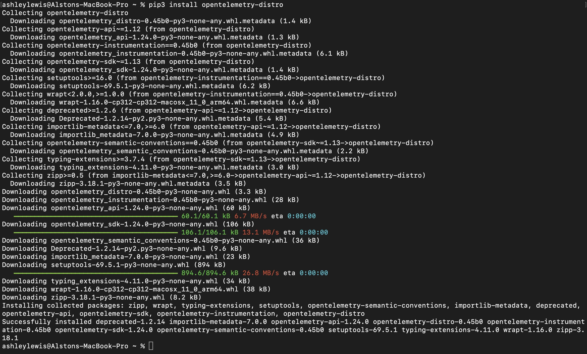
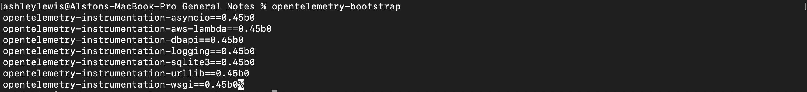

# Install OpenTelemetry-Distro
    pip3 install opentelemetry-distro




# Let OpenTelemetry decide which instrumentation I might want for a project
    opentelemetry-bootstrap (This lists out the packages)
    opentelemetry-bootstrap -a install (This will install the recommended packages)  
    


# Instrument
opentelemetry-instrument \
    --traces_export console --metrics_exporter console --logs_export console
    ./app.py


# Add a trace
```python
from opentelemetry import trace

tracer = trace.get_tracer(__name__)

def do_work():
    with tracer.start_as_current_span("span-name") as span:
        #do some work that the span will track
        print("doing some work")
        #when the with block goes out of scope, the 'span' is closed for you

# Alternate way to wrap a function

@tracer.start_as_current_span("do_some_work")
def do_some_work:
    # do some work that the span will track
    print("Doing other work")
    # span is stopped when the method goes out of scope

def do_work():
    with tracer.start_as_current_span("parent-span") as parent:
        #do some work that the parent will track
        print("doing some work")
        #Create a nested span to track nested work
        with tracer.start_as_current_span("child-span") as child:
            child.set_attribute("operation.value",1)
            child.set_attribute("operation.name","saying hello")
            child.set_attribute("operation.value",[1,2,3])
            # do some work that child tracks
            print("doing some nested work")

            # You can add events that mark out time points
            child.add_event("Gonna try it")
            do_the_thing()
            child.add_event("Finished doing it")
            #The nested span is closen when it is out of scope
        #This parent span is also closed when it is out of scope
```

# Metrics
```python
from opentelemetry import metrics

meter = metrics.get_meter(__name__)

things_done_counter = meter.create_counter("things_done",description="count the number of things done")

def do_the_thing:
    # Do Stuff
    things_done_counter.add(1)